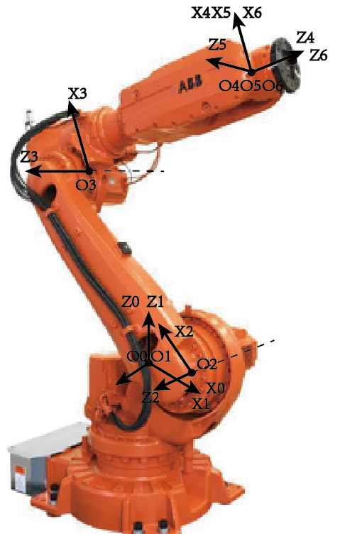
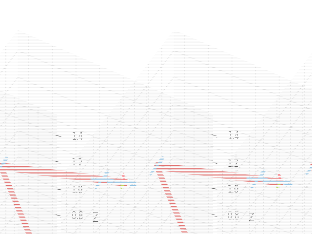

# 六连杆机械臂运动控制程序及Roarm_m2_s正逆运动学结算
# 项目描述
该程序实现了对六连杆机械臂的运动控制，包括运动学参数的计算和机械臂姿态的可视化。
# 运行环境
>* Python 3.x
>* roboticstoolbox库

# 安装必要库
> pip install roboticstoolbox-python
# 使用方法

>* 在运行该程序前，请确保安装了Python 3.x和roboticstoolbox库。
>* 将程序中的init_T和theta设置为机械臂的初始姿态和运动学参数。
>* 执行CreateDH.py，程序将自动计算机械臂的正逆运动学并将姿态可视化。
# 仿真实物对照图

    
    

# 仿真动图

# 参考资料：

https://github.com/petercorke/robotics-toolbox-python

